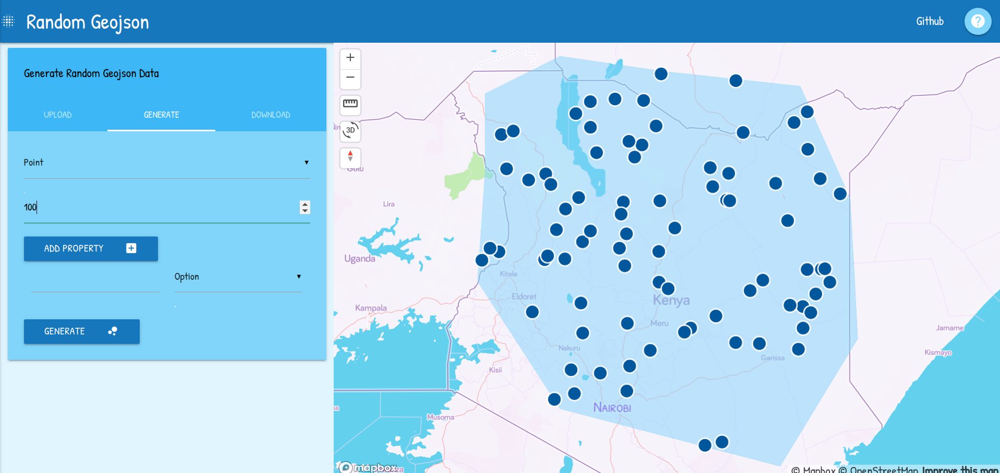

# MaterialBox

## Introduction

MaterialBox is an open source template for creating beautiful mobile-responsive webmaps with html, css and javascript. It was created with the help of [Materialize](https://materializecss.com/ "Materialize") and [Mapbox GL JS](https://docs.mapbox.com/mapbox-gl-js/api/ "Mapbox GL JS"). View [demo](https://materialbox.surge.sh/)

## Run Locally

Clone application

```git clone https://github.com/Grace-Amondi/MaterialBox.git```

Move into the ordinary_kriging directory

```cd MaterialBox```

Change .env.example to .env and Set your *mapbox access token*.Install node modules

```npm install```

Run application

```npm start```

Open application at http://localhost:1234

---

## Build for production

To build the app for production,

```npm run build```

Navigate to /dist folder and deploy to [surge](https://surge.sh/ "surge") or [github pages](https://pages.github.com/ "github pages")

---
